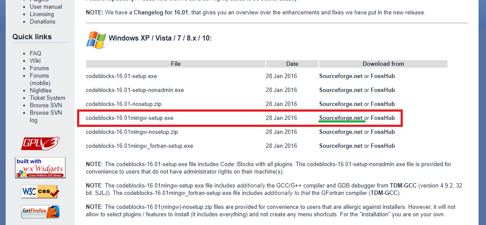
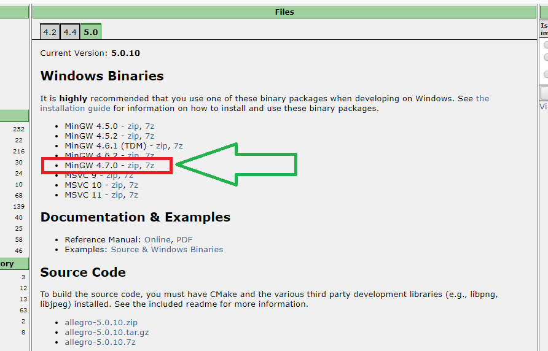
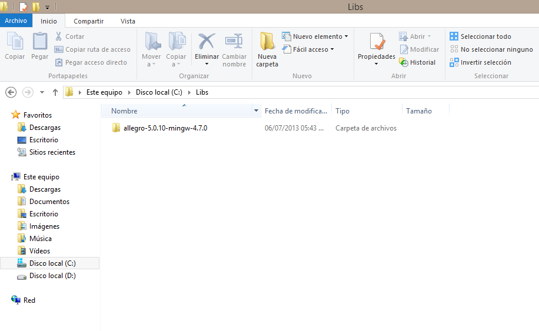
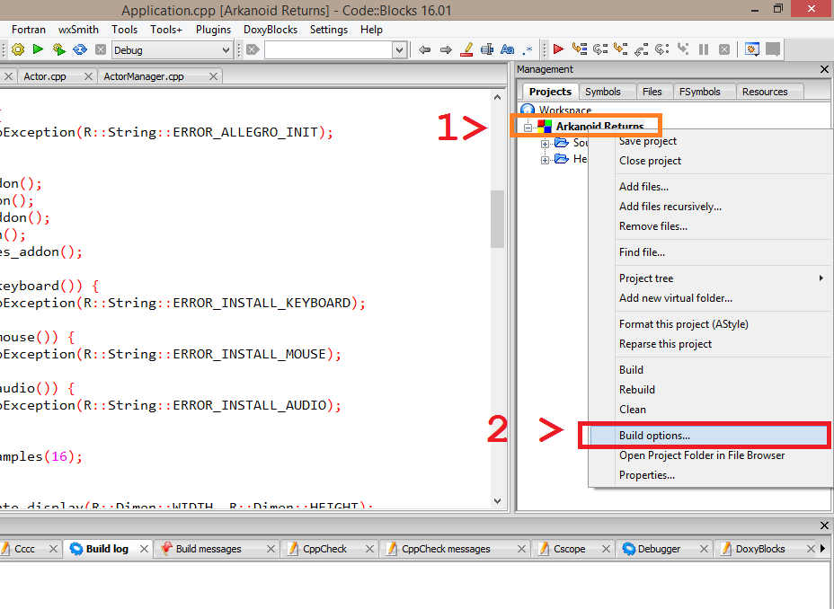

# Arkanoid Returns (Un Remake del juego Arkanoid)

Juego Arkanoid hecho en C++ con ayuda de la librería Allegro 5.
## Instalación (WINDOWS)

### 1 .- Codeblocks
Lo primero que debes hacer es descargar el instalador del IDE CodeBlocks, lo puedes hacer desde [ésta](http://www.codeblocks.org/downloads/26) página.

Luego de descargar el instalador lo ejecutas y sigues la típica instalación de un programa(next, next, next).

### 2 .- Allegro 5
Descarga los binarios de allegro 5 desde [Aquí](https://www.allegro.cc/files/)

### 3.- Extraer
Una vez descargado los binarios de allegro5 vamos a extraer los archivos en una carpeta, yo lo extraigo en **C:\Libs\\**, pero **puedes extraerlo donde quieras**.

### 4.- Descargar el proyecto
Para descargar el proyecto podemos hacerlo de clonando el repositorio o descargando los archivos desde github.

Clonando el proyecto : 
~~~
git clone https://github.com/dantehemerson/Arkanoid-Returns.git
~~~

**ó puedes descargarlo desde github en la opcion Clone or Download>Dowload Zip**

### 5.- Abriendo el proyecto
Ahora vamos dentro de la carpeta principal del proyecto(**Arkanoid/**) y ejecutamos el 
archivo **Arkanoid Returns.cbp** con CodeBlocks.  
También puedes hacer esto desde codeblocks :
		**File > Open >** y nos vamos a la carpeta donde descargamos el proyecto y seleccionamos **Arkanoid Returns.cbp**

### 6.- Configurando el proyecto 
Una vez abierto el proyecto en C::B en el área **Management**  
damos **click derecho** en el proyecto y luego **click** en **Build Options**

